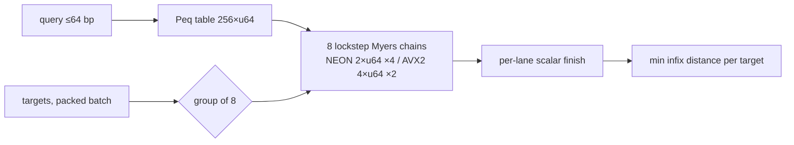

# myers-batch

[](https://github.com/bmouler/myers-batch/actions/workflows/ci.yml)


[](LICENSE)

Batched infix edit distance for DNA. Bit-parallel Myers on aarch64 NEON and x86-64 AVX2,
runtime-dispatched, **7.5-10x faster than edlib single-threaded** on the reference machine,
with bit-identical results.

Adapter trimming, primer matching, barcode and UMI demultiplexing, and probe search all reduce
to the same question asked hundreds of millions of times: what is the minimum edit distance
between this short query and any substring of this read? [edlib](https://github.com/Martinsos/edlib)
is the standard answer and is excellent, but it exposes one alignment per call and its inner loop
is scalar 64-bit — there are no SIMD intrinsics anywhere in its 1482 lines. This library keeps
edlib's algorithm and semantics, and changes the two things that were leaving performance on the
floor: it takes the whole batch in one call, and it runs eight alignments per inner iteration.

## Install

```console
python -m pip install myers-batch
```

For editable development:

```console
python -m pip install -e ".[dev]"
```

Building needs a C compiler; there are no runtime dependencies.

## Quickstart

```python
>>> import myers_batch
>>> myers_batch.distances(b"ACGTACGT", [b"TTACGTACGTTT", b"TTTTTTTT"])
[0, 6]
>>> myers_batch.have_neon(), myers_batch.lanes()
(True, 8)
```

One query against many targets. The query must be 1-64 bp; targets are any length.
`distances` releases the GIL, so you can shard a batch across a thread pool.

## Benchmark

Reproduce with `python bench/bench.py`. It refuses to print timings unless every result
matches edlib first. Numbers below are one run, typical of three consecutive runs: this
kernel varies about 2% run to run, edlib about 5%, so treat the headline as 7.5-10x rather
than any single decimal.

These timings were measured on an Apple M3 Max and exercise the NEON kernel. No x86-64
timing is quoted because none was measured; x86-64 CI establishes AVX2 activation and
bit-identical correctness, not a performance claim.

```
machine : macOS-15.5-arm64-arm-64bit / arm64
python  : 3.11.12
kernel  : NEON=True lanes=8

=== TruSeq Read 1 adapter  (query 33bp, 200000 x 150bp reads) ===
  results identical to edlib on all 200000 reads: True
  edlib k=-1             374.48 ms     0.53M pairs/s
  edlib k=5              305.36 ms     0.65M pairs/s
  edlib k=2              306.57 ms     0.65M pairs/s
  myers-batch scalar     103.56 ms     1.93M pairs/s
  myers-batch NEON        37.57 ms     5.32M pairs/s
  speedup vs edlib unbounded :  9.97x
  speedup vs edlib k=5        :  8.13x
  speedup vs edlib k=2        :  8.16x
  of which: batch API + single-word path  3.62x, NEON vectorization  2.76x
  [8 threads, not part of the algorithmic claim]    23.82 ms     8.40M pairs/s   15.72x vs single-thread edlib

=== 16bp cell barcode  (query 16bp, 200000 x 150bp reads) ===
  results identical to edlib on all 200000 reads: True
  edlib k=-1             367.35 ms     0.54M pairs/s
  edlib k=3              304.24 ms     0.66M pairs/s
  edlib k=1              300.76 ms     0.66M pairs/s
  myers-batch scalar     104.35 ms     1.92M pairs/s
  myers-batch NEON        37.55 ms     5.33M pairs/s
  speedup vs edlib unbounded :  9.78x
  speedup vs edlib k=3        :  8.10x
  speedup vs edlib k=1        :  8.01x
  of which: batch API + single-word path  3.52x, NEON vectorization  2.78x

=== 64bp capture probe  (query 64bp, 100000 x 300bp reads) ===
  results identical to edlib on all 100000 reads: True
  edlib k=-1             279.72 ms     0.36M pairs/s
  edlib k=8              241.69 ms     0.41M pairs/s
  myers-batch scalar     105.14 ms     0.95M pairs/s
  myers-batch NEON        37.28 ms     2.68M pairs/s
  speedup vs edlib unbounded :  7.50x
  speedup vs edlib k=8        :  6.48x
  of which: batch API + single-word path  2.66x, NEON vectorization  2.82x
```

Read the decomposition line, not just the headline. Roughly 2.7-3.6x comes from taking the
batch in one call and specializing the single-word case, and a further 2.8x from the
vectorization. Both are real, but they are different kinds of win, and attributing all of it
to SIMD would be misleading.

The multi-threaded row is listed for completeness and is deliberately excluded from the claim:
edlib is single-threaded by design, so comparing 8 threads against 1 measures the thread count,
not the kernel.

### End-to-end batch throughput

The edlib comparison above isolates the kernel's external position. A second benchmark measures
the improvement over the pre-change `myers-batch` API itself:

```console
PYTHONPATH=src python bench/bench.py --e2e-json
```

It materializes distances for 100,000 mixed-length targets totaling 17,635,600 bytes and checks
the complete result against the scalar kernel. On the same Apple M3 Max with CPython 3.11.12 on
2026-08-15, 11 samples after three warmups measured frozen baseline `4821adc9e51d` at
**42.541 ms** median and length-grouped NEON dispatch at **18.201 ms**, a **2.337x speedup**.
Both runs produced SHA-256
`26b487d016a5afc7c4f35f42af23912125aaacbb93845a7b6dc4522922316ba0`. Target
generation and interpreter startup are excluded; validation, buffer packing, native execution,
and Python-list materialization are included. Rebuild the extension in each worktree before a
direct comparison.

## How it works



The recurrence is Hyyro's formulation of Myers (1999), the same one edlib uses. Per target
character, with `VP`/`VN` the vertical delta bitvectors:

```
Xv = Eq | VN
Xh = (((Eq & VP) + VP) ^ VP) | Eq
Ph = VN | ~(Xh | VP)
Mh = VP & Xh
score += (Ph >> (m-1)) & 1 ;  score -= (Mh >> (m-1)) & 1
VP = (Mh << 1) | ~(Xv | (Ph << 1))
VN = (Ph << 1) & Xv
```

Three properties make it vectorize cleanly:

1. **The score updates are branch-free.** `Ph` and `Mh` are provably disjoint: `Mh` is a subset
   of `VP`, and `Ph & VP == 0` because `VP & VN == 0`. So both updates apply unconditionally
   instead of as an `if/else if`, which is what lets lanes proceed in lockstep.
2. **Every operation is per-lane 64-bit.** AND, OR, XOR, NOT, ADD, SHIFT. The carry in
   `(Eq & VP) + VP` propagates upward within a lane and never crosses lanes. NEON therefore
   uses four independent chains of two 64-bit lanes; AVX2 uses two independent chains of
   four lanes. Both advance eight targets per iteration without cross-lane shuffles.
3. **The loop is latency-bound, not throughput-bound.** The add feeds the xor feeds the or feeds
   the next iteration. The independent chains let the scheduler overlap that latency. On the
   reference M3 Max, two NEON lanes measured only 1.26x over scalar; four lanes across two
   chains gave 2.35x, and eight lanes across four chains gave 3.61x, using 16 of 32 vector
   registers with no spills.

Infix semantics come from the horizontal carry into the shift being zero, mirroring edlib's
`calculateBlock` with `hin == 0`. A carry of one would give global (NW) distance instead.

The C API retains the scalar and NEON widths for differential measurement. The public
`hw_batch` dispatcher selects NEON at compile time on aarch64, checks
`__builtin_cpu_supports("avx2")` at runtime on x86-64, and otherwise selects the portable
scalar kernel. The AVX2 functions carry a per-function `target("avx2")` attribute, so wheels
remain portable and AVX2 instructions are isolated from the fallback path. Python exposes
the dispatcher as `distances`, the portable path as `distances_scalar`, and the active
selection as `simd_backend`.

## Correctness

The claim is bit-identical output, so that is what the tests check, against two independent
oracles:

- a pure-Python O(nm) dynamic-programming reference, which keeps the suite self-contained
- edlib itself, differentially, over randomized queries, target lengths and planted approximate
  occurrences

Batch sizes 1-17 plus 63/64/65 are all exercised, so every possible scalar remainder after the
8-wide blocks is covered, and ragged target lengths are tested explicitly because that is where
lanes finish at different times and the per-lane scalar tail has to take over. CI requires the
NEON backend on aarch64 and AVX2 on hosted x86-64, then checks both against edlib and the scalar
implementation for bit-identical output.

The CI 100% coverage gate measures the Python API and dispatcher only; it does not claim C line
coverage for the compiled kernel. Native-kernel correctness is instead checked differentially
against edlib across randomized and structured inputs, in addition to the independent
dynamic-programming oracle.

## Limitations

- **Query length 1-64 bp.** One bitvector word. Longer queries need Hyyro's multi-word blocks,
  which are not implemented. This covers adapters, primers, barcodes, UMIs and probes; it does
  not cover read-to-read alignment.
- **Infix distance only.** No global (NW) or prefix (SHW) mode.
- **Distance only.** No CIGAR, no alignment path, no match location. If you need those, use edlib.
- **No Ukkonen banding.** edlib can early-terminate under a `k` cutoff; this kernel always scans
  the full target. It still wins at the cutoffs benchmarked above, but for very long targets with
  a very small `k` that advantage will narrow and could reverse.
- **Two SIMD ISAs, no generic-vector fallback.** aarch64 uses NEON and supported x86-64 CPUs use
  AVX2; other CPUs use the portable scalar kernel. The AVX2 path is activated and compared
  against edlib on x86-64 CI, but no x86 speed claim is made because none was benchmarked.

## Non-goals

Not a general alignment library, not a replacement for edlib's full feature set, and not a
scoring-matrix aligner. It does one kernel on two ISAs (NEON, AVX2), faster.

## License

MIT.